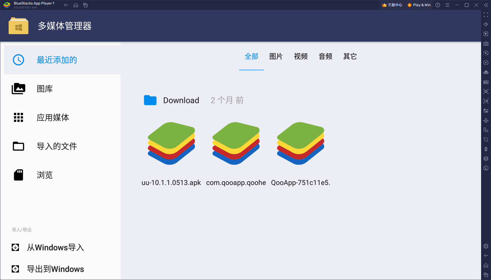
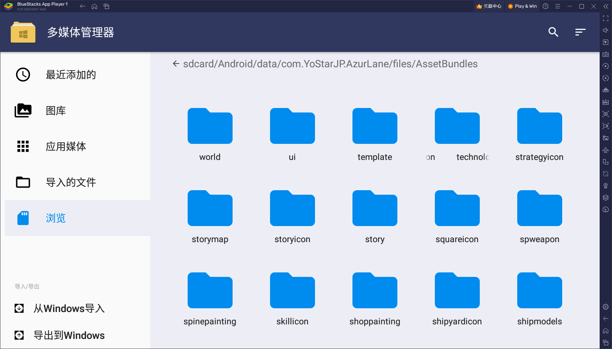

# 以Blustack为例

进入多媒体管理器

浏览->Android/data/com.YoStarJP.AzurLane/files/AssetBundles

[B站教程](https://www.bilibili.com/read/cv34745365/?spm_id_from=333.999.0.0&jump_opus=1)

[Github解包软件链接](https://github.com/aelurum/AssetStudio/releases)